# 🧪 Testing Documentation — MSE Memory Game

This file documents the testing and validation process for the **MSE Memory Game** project.  
It includes validation results, manual testing, responsiveness checks, and accessibility audits.

---

## 🎨 Design & Wireframes

The layout was initially planned on paper to visualize the main structure of the game, including the header, control buttons, game board, and footer section.

### Wireframe Sketch
The original wireframe concept:

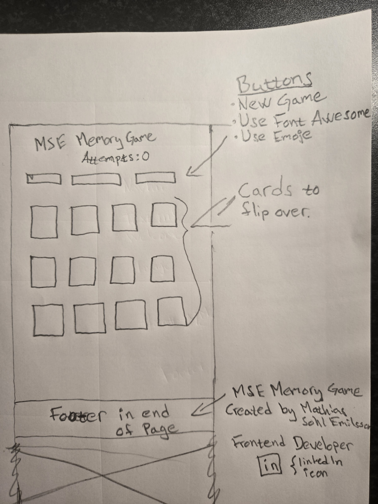

### Responsive Mockup
The responsiveness of the website was tested using [Am I Responsive](https://ui.dev/amiresponsive), confirming consistent design across different screen sizes.

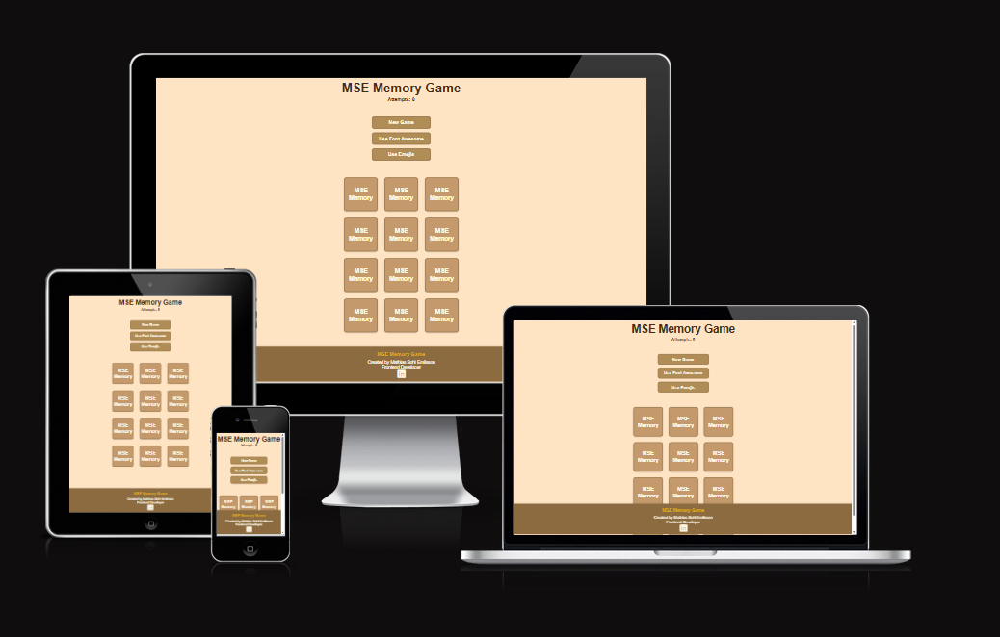

---

## 🧩 Manual Testing

All functionality was manually tested on **Google Chrome (Windows 11)** using various screen sizes.

| Test | Expected Result | Outcome |
|------|------------------|----------|
| Start new game | Cards reset and shuffle randomly | ✅ Works correctly |
| Flip cards | Two cards flip and compare | ✅ Works correctly |
| Match pair | Matched cards stay revealed | ✅ Works correctly |
| Win condition | “You won” message appears with attempt count | ✅ Works correctly |
| Font Awesome mode | Cards show Font Awesome icons | ✅ Works correctly |
| Emoji mode | Cards show emojis | ✅ Works correctly |
| Score counter | Increases only when two cards are flipped | ✅ Works correctly |
| Footer link | Opens LinkedIn in new tab | ✅ Works correctly |
| Responsiveness | Layout adjusts correctly on all device sizes | ✅ Works correctly |
| Footer separation | Footer does not overlap with cards on mobile | ✅ Works correctly |

---

## ✅ Validation Testing

### HTML Validation
HTML was validated using the **W3C Nu HTML Checker** —  
**Result:** No errors or warnings found.

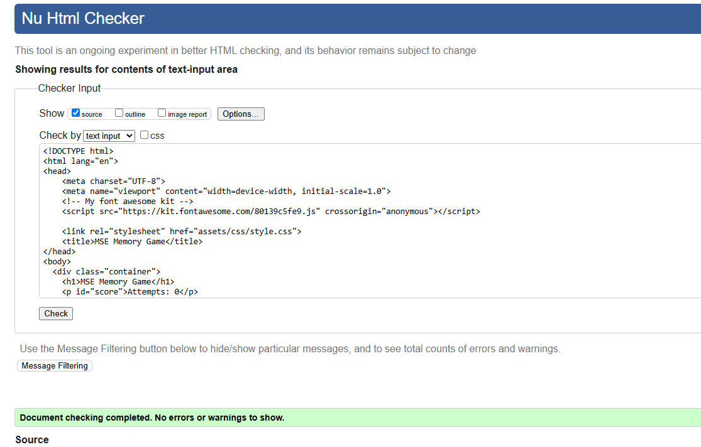

---

### CSS Validation
CSS was validated using the **W3C CSS Validation Service** —  
**Result:** No errors found.  
⚠️ One minor *warning* about identical `background-color` and `border-color` on hover state.  
This was intentional for a consistent design and does not affect usability or accessibility.

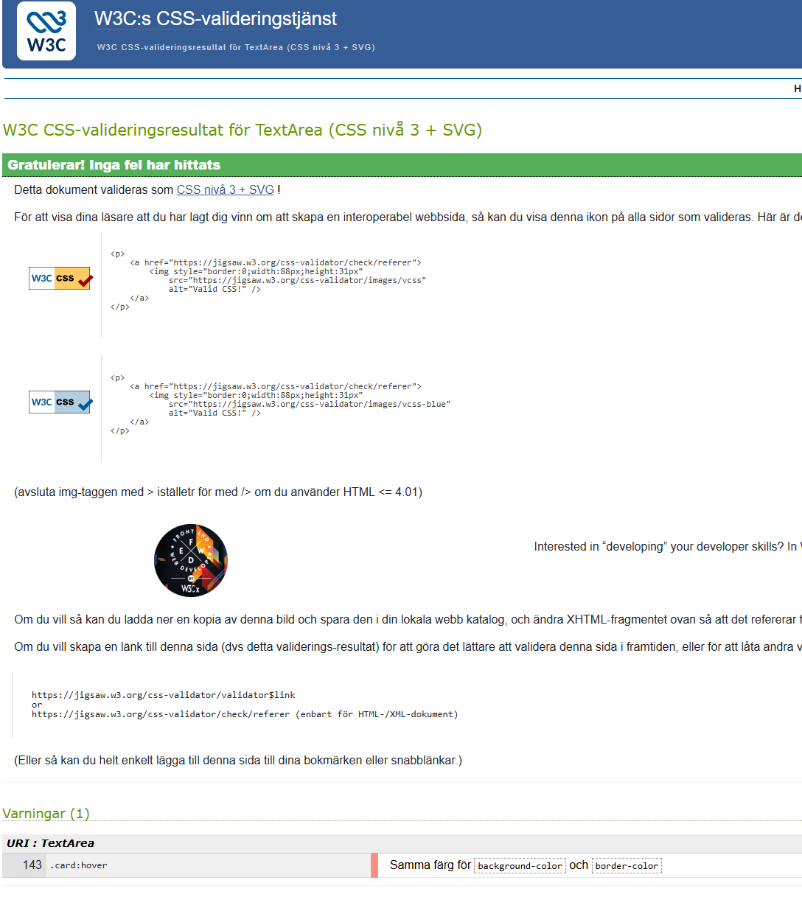

---

### JavaScript Validation
The JavaScript file was checked using **JSHint**.  
No critical errors were found — only ES6 compatibility warnings (e.g., `const`, `let`, arrow functions).  
These are acceptable since the code runs fully in modern browsers.

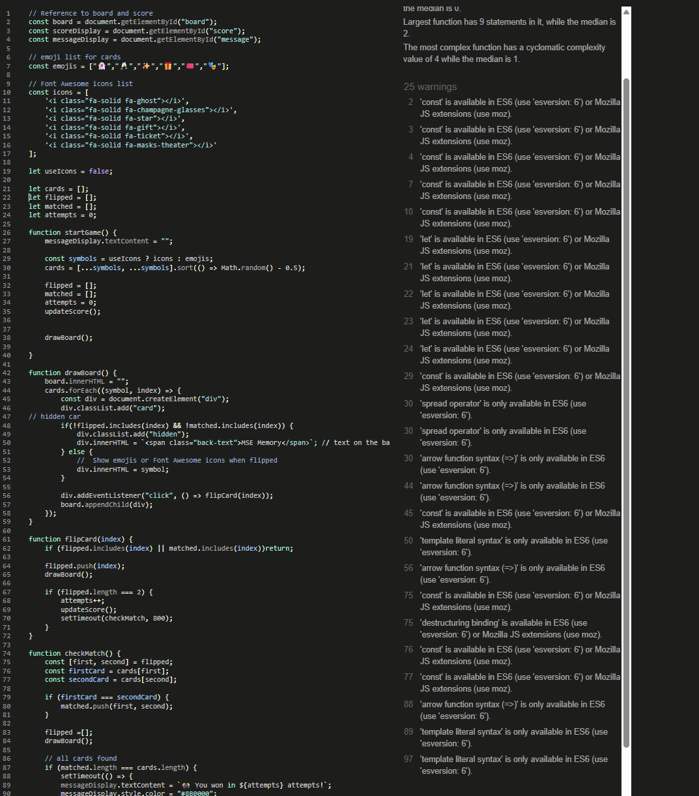

---

## 🌍 Responsiveness Testing

The game was tested across multiple devices and resolutions using Chrome DevTools.

**Devices tested:**
- Desktop (1920x1080)
- Laptop (1366x768)
- iPad Air / iPad Pro (Tablet simulation)
- iPhone SE / iPhone 12 Pro (Mobile simulation)

**Result:**  
The layout adapts perfectly to all screen sizes.  
Buttons, cards, and footer remain aligned and accessible on all devices.

### Screenshots
**Desktop view:**
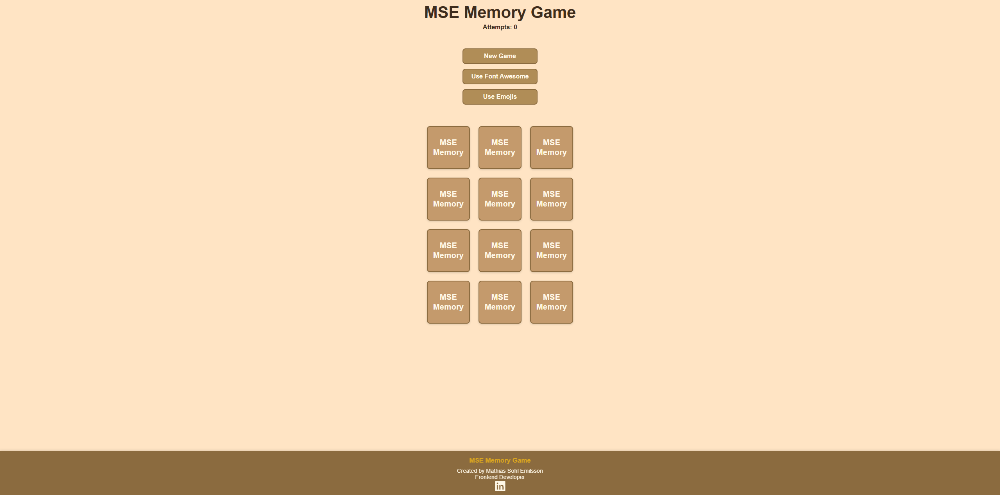

**Mobile view (part 1):**
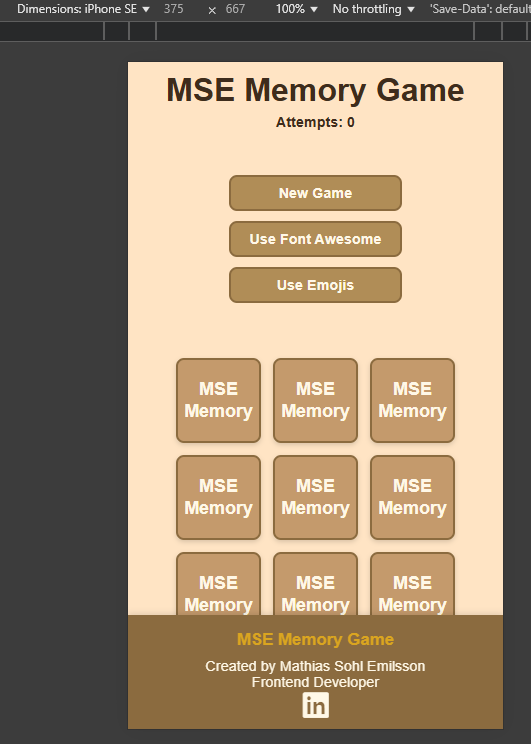

**Mobile view (part 2):**
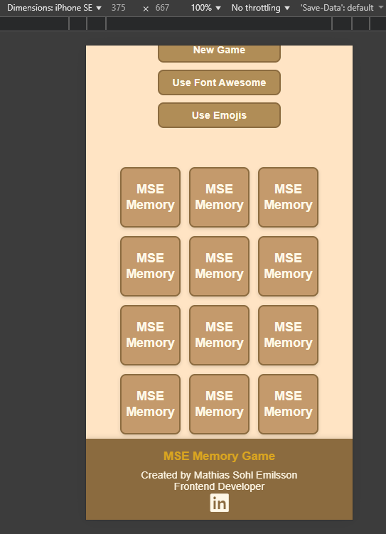

**Font Awesome mode (with win message):**
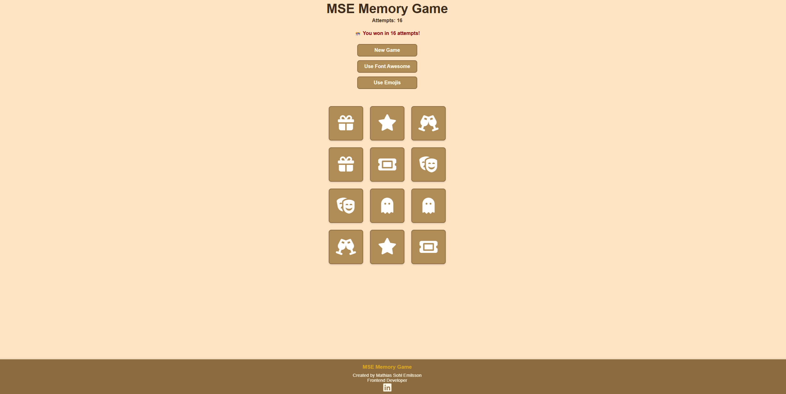

**Emoji mode (with win message):**
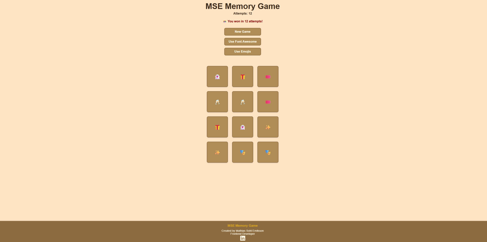

---

## 💡 Lighthouse Audit

A Lighthouse test was run in **Google Chrome DevTools** to measure site performance and accessibility.

| Category | Score |
|-----------|--------|
| Performance | 99 |
| Accessibility | 92 |
| Best Practices | 100 |
| SEO | 90 |

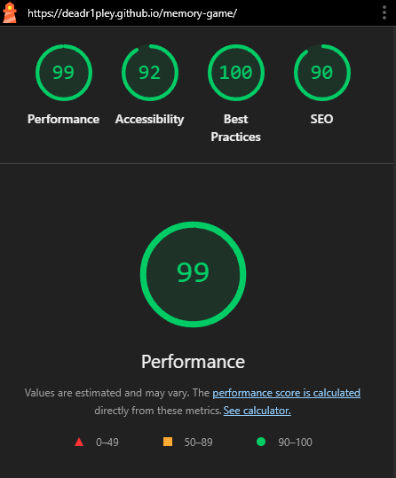

### Accessibility Note
The only flagged issue was **low color contrast** between background and button text.  
This was a deliberate stylistic choice to maintain the warm color palette of the site.

---

## 🧠 Known Issues

- Minor **contrast ratio warning** in Lighthouse (Accessibility score 92).  
  Does not affect usability.  
- Game currently tested only on **Google Chrome**, but expected to perform equally on Firefox, Edge, and Safari.

---

## 📋 Summary

All functionality works as intended.  
The site is fully responsive, validated without critical errors, and achieves strong performance scores.  
The project meets all criteria for accessibility, structure, and interactivity.

---

✅ **Final Result:**  
**MSE Memory Game** is a functional, responsive, and accessible browser-based game that performs excellently across all tested conditions.

---

### 🗂️ File Placement Note

All testing-related screenshots are stored in the **`assets/testing/`** folder.  
All design and layout planning images (wireframes and mockups) are stored in the **`assets/wireframes/`** folder.
✅ Instruktion: